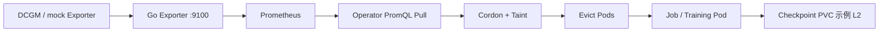

# AI-k8s-Platform

基于 Kubernetes 的**自愈型** AI 算力平台：在 GPU 硬件故障（如 DCGM XID）发生前预警，故障后自动隔离节点、驱逐任务并在健康节点上恢复训练（配合 Checkpoint）。

> 机器冒烟前把任务捞出来，机器宕机后让任务自动复活。

## 架构概览



| 层级 | 组件 |
|------|------|
| 感知层 | Exporter → Prometheus（ADR：仅 Pull，无 Webhook MVP） |
| 控制面 | Operator（`client-go`，`healing-state` 状态机） |
| 自愈 | Cordon → Taint → 驱逐 → Job 重建 |

详细说明见 [项目计划.md](./项目计划.md)、[docs/p2-acceptance.md](./docs/p2-acceptance.md)、[docs/interview-pitch.md](./docs/interview-pitch.md)、[docs/interview-faq.md](./docs/interview-faq.md)。

## 面试快速入口

| 文档 / 命令 | 用途 |
|-------------|------|
| [docs/interview-pitch.md](./docs/interview-pitch.md) | 30s / 3min / 5min 口播 |
| [docs/interview-faq.md](./docs/interview-faq.md) | 15 个高频追问 |
| [docs/known-limitations.md](./docs/known-limitations.md) | MVP 边界（主动说明） |
| [docs/cloud-lab.md](./docs/cloud-lab.md) | **L3 云 VM 录屏**（3×2C4G k3s） |
| `./scripts/demo.sh --kind` | 本地 CI 级 demo（L1-B） |
| `./scripts/demo-cloud.sh` | 云上主打 demo（需 k3s 集群） |
| `./scripts/demo-record.sh` | Grafana + 终端录屏流程 |


## 目录结构

```
cmd/operator/          # Operator 入口
cmd/exporter/          # 指标导出 + XID 注入
internal/healing/      # 自愈编排
internal/operator/     # 轮询、metrics、JSON 日志
internal/prometheus/   # PromQL 客户端
deploy/manifests/      # K8s 清单
scripts/               # e2e、demo、uncordon
```

## 快速开始

**依赖：** Go 1.22+、`kubectl`；L1-B 另需 Docker + [kind](https://kind.sigs.k8s.io/)。

```bash
git checkout dev
make build
make test
```

### 演示（P4，推荐）

```bash
# L1-A：当前 kubectl context（如 k3s 单节点 Plan B）
./scripts/demo.sh

# L1-B：kind 双节点严格换节点（约 2–3 分钟）
./scripts/demo.sh --kind

# 只打 JSON 日志，不改集群
./scripts/demo.sh --dry-run

./scripts/demo.sh --help
```

步骤说明：[docs/demo-runbook.md](./docs/demo-runbook.md)

### E2E 回归

```bash
# L1-A（k3s / default context）
kubectl config use-context default   # 按你的环境调整
./scripts/e2e-k3s.sh

# L1-B（需 Docker）
./scripts/e2e-kind.sh

# 真 PromQL 子路径（kind 保留集群时）
KEEP_CLUSTER=true RUN_PROMQL_E2E=true ./scripts/e2e-kind.sh
```

演示后回滚节点：`./scripts/uncordon.sh <node-name>`

### 本地 Operator（开发）

```bash
export PROMETHEUS_MOCK=true PROMETHEUS_MOCK_NODES=<node>
export HEALING_DRY_RUN=true METRICS_LISTEN=:18081
go run ./cmd/operator
curl -s localhost:18081/metrics | grep operator_up
```

### Observability（P5-Obs，Grafana 演示）

```bash
./scripts/demo-record.sh              # 推荐：录屏编排
./scripts/observability-stack.sh up   # 或手动栈
```

### L2 Checkpoint（可选）

```bash
./scripts/demo-l2.sh
```

### L3 云 VM（面试主打录屏）

见 [docs/cloud-lab.md](./docs/cloud-lab.md)：

```bash
export KUBECONFIG=~/.kube/config-cloud
./scripts/demo-cloud.sh
```

详见 [docs/observability.md](./docs/observability.md)、[docs/examples/grafana/README.md](./docs/examples/grafana/README.md)。

## 变更记录

见 [CHANGELOG.md](./CHANGELOG.md)。

本地开发与 Cursor Agent 说明见 [AGENTS.md](./AGENTS.md)。

## License

TBD
