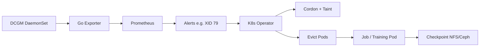

# AI-k8s-Platform

基于 Kubernetes 的**自愈型** AI 算力平台：在 GPU 硬件故障（如 DCGM XID）发生前预警，故障后自动隔离节点、驱逐任务并在健康节点上恢复训练（配合 Checkpoint）。

> 机器冒烟前把任务捞出来，机器宕机后让任务自动复活。

## 架构概览



| 层级 | 组件 |
|------|------|
| 感知层 | DCGM + Go Exporter → Prometheus |
| 控制面 | Custom Operator（`client-go` / kubebuilder） |
| 自愈 | Cordon → Taint → 驱逐 → Job 重建 + 断点续训 |

详细说明见 [说明文档.txt](./说明文档.txt)、[docs/architecture.md](./docs/architecture.md)。

## 目录结构

```
cmd/operator/          # Operator 入口
cmd/exporter/          # 指标导出
internal/controller/   # 控制器逻辑
internal/healing/      # 自愈编排
internal/prometheus/   # 指标 / 告警查询
deploy/manifests/      # K8s 清单
deploy/helm/           # Helm（可选）
```

## 快速开始

```bash
# 依赖： Go 1.22+, kubectl, 可选 kind/minikube
make build
make test
```

本地开发与 Cursor Agent 说明见 [AGENTS.md](./AGENTS.md)。

## 开发路线

1. 用 Go + `client-go` 实现 Node cordon / 标签 / 污点。
2. 从 Prometheus 读取（或模拟）GPU 故障指标。
3. 故障触发：驱逐 Pod，由 Job 在健康节点拉起；Pod 挂载共享存储上的 Checkpoint。

## License

TBD
