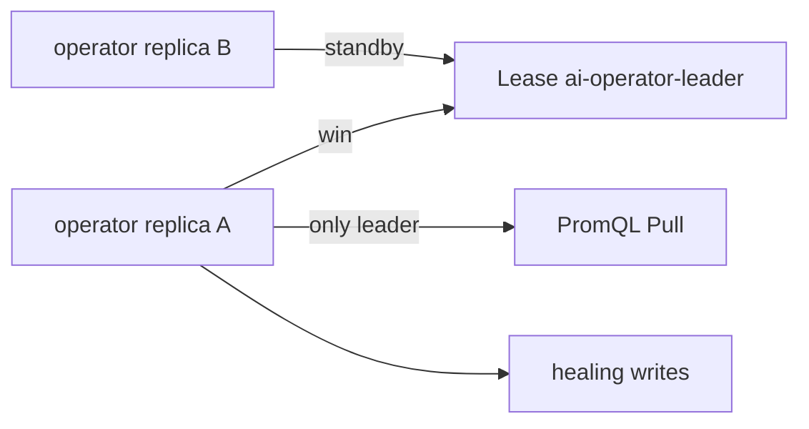

# 社招向：演进设计题（不要求 MVP 实现）

## 设计题 1：Operator 高可用（Leader Election）

**现状：** 单副本 Deployment；`healing-state` Node 标签保证工作流幂等。

**目标：** 多副本避免控制面 SPOF，且不能双写 Cordon/Evict。

**方案草图：**

- 使用 `client-go/tools/leaderelection` + `coordination.k8s.io/Lease`。
- **仅 Leader** 跑 PromQL tick 与 `handleNode`；Follower 只暴露 `/metrics` 或 `operator_up=0`。
- 幂等仍靠 Node 标签；Leader 切换时新 Leader 读 etcd 续跑。
- RBAC 增加 `leases` resource。

**面试一句：** HA 在选主，幂等在 etcd 标签，两者正交。

---

## 设计题 2：Volcano gang 训练 Job 适配

**现状：** `batch/v1` Job 单 Pod；驱逐一个 Pod 即可触发 Job 重建。

**目标：** PyTorchJob / VolcanoJob 多 Pod gang：一张卡故障需迁整组。

**方案草图：**

1. **发现：** PromQL 命中 fault node → 列出该节点上带 `volcano.sh/job-name` 或 `training.kubeflow.org/job-name` 的 Pod。
2. **决策：** 若 gang 任一副本 on fault node → cordon node + evict **同 job 全部 Pod**（label selector）。
3. **恢复：** Volcano Job 控制器重建 gang；checkpoint 仍走 PVC/共享存储契约。
4. **接口：** `internal/healing/evict.go` 抽象 `EvictTrainingPods(ctx, selector)`；Volcano 适配器提供 gang selector。

**风险：** gang 部分成员已在其他节点时，Evict 策略需 ADR（整 job 重启 vs 仅 fault node 成员）。

**面试一句：** MVP 证单 Pod 链路；gang 是 evict 范围的扩展，不是重写状态机。

---

## 设计题 3（简）：Alertmanager Webhook 与 Pull 并存

- Webhook 负责秒级触发；Pull 负责兜底与对账。
- 需 ADR-0002：重复触发归 `healing-state` + cooldown；Webhook handler 与 `internal/prometheus` 共用 `handleNode` 入口。

见 [adr/0001-mvp-promql-pull-only.md](./adr/0001-mvp-promql-pull-only.md) 负面后果与 Post-MVP 列表。
