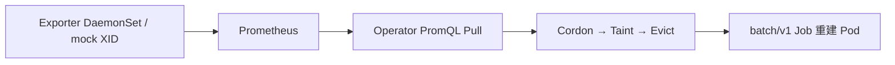

# 面试话术

> 三档口播 + L3 云 demo 为主打。FAQ：[interview-faq.md](./interview-faq.md)｜边界：[known-limitations.md](./known-limitations.md)

## 一句话

**机器冒烟前把任务捞出来，机器宕机后让任务自动复活。**

---

## 30 秒版（电梯）

GPU XID 进 Prometheus，Operator PromQL 轮询发现故障节点，自动 Cordon、Taint、驱逐训练 Pod；Job 控制器在**另一台 worker** 拉起新 Pod。我在 **3 台云 VM** 上录屏演示；指标 mock 可换 DCGM，编排逻辑不变。

---

## 3 分钟版（校招推荐）

1. **痛点**：长训练单卡 XID → NCCL 挂 → 整 job 死；SRE 半夜手工 cordon。
2. **架构**：Exporter → Prometheus → Operator（Pull only，ADR-0001）→ healing 状态机 → Job 重建。
3. **亮点**：Node 标签 `healing-state` 幂等 + 崩溃续跑；e2e-kind 严格换节点；Grafana 因果链。
4. **边界**：不承诺续训/NCCL；L2 是 PVC 契约示例。
5. **演示**： `./scripts/demo-cloud.sh` 或 `./scripts/demo.sh --kind`。

---

## 5 分钟版（社招推荐）

在 3 分钟基础上增加：

- **与 NPD/CA/DCGM Exporter 分工**（见下表）
- **trade-off**：单副本 Operator、30s 轮询、整节点 cordon
- **演进**：Leader Election、AM Webhook、Volcano gang——见 [interview-deep-dive.md](./interview-deep-dive.md)
- **三级环境**：L1 kind=CI，L3 云 VM=录屏主打

## 架构（30 秒）



- **感知：** `gpu_xid_errors_total`（MVP mock；Post-MVP DCGM Exporter）。
- **决策与执行：** 专用 Operator + `healing-state` 状态机。
- **恢复（K8s 层）：** Job 新 Pod Running；`WaitForReschedule` 确认。

## 与社区方案差异

| 方案 | 做什么 | 与本项目 |
|------|--------|----------|
| NVIDIA DCGM Exporter | GPU 指标 | 可替换 mock；Operator 不重复采集 |
| Node Problem Detector | 节点 Condition | 不覆盖 XID→训练驱逐闭环 |
| Cluster Autoscaler | 扩容 | 不管 Cordon 节点上 Pod 迁移 |
| Volcano / Kueue | gang / 队列 | MVP 用 batch Job |
| 告警 + runbook | 通知 | 我们是 **closed-loop** |

## MVP 边界

| 层级 | 平台承诺 | 不承诺 |
|------|----------|--------|
| **L1** | PromQL → 隔离 → 驱逐 → Job 新 Pod Running | 梯度续训、NCCL 容错 |
| **L2** | Job + PVC checkpoint 路径示例 | Operator 内续训 |
| **L3** | 云 VM 多节点录屏 demo | GPU 真机、生产 HA |

## 亮点数据（e2e / demo 口径）

| 口径 | 脚本 | 说明 |
|------|------|------|
| **L1-A Plan B** | `e2e-k3s.sh` | 单节点；**非主打** |
| **L1-B** | `e2e-kind.sh` | 2 worker 严格换节点；CI required |
| **真 PromQL** | `e2e-promql.sh` | Exporter inject → Prometheus → cordon |
| **L3 云** | `demo-cloud.sh` | 3 VM k3s；面试录屏主打 |
| **触发后 Cordon** | e2e timing 输出 | 通常 **≤10s**（PromQL 命中后） |
| **端到端 TTR** | e2e timing 输出 | 含轮询周期，demo **≤90s** |

运行 e2e 后查看 `=== Healing timing ===` 块获取实测值。

## 排障

| 场景 | 做法 |
|------|------|
| 误隔离 | `./scripts/uncordon.sh <node>` |
| dry-run | `HEALING_DRY_RUN=true` / `demo.sh --dry-run` |
| 卡在哪 | Node `healing-state` 标签链 |
| 指标 | Grafana **AI 平台自愈监控** |

## 演示命令

```bash
# 开发 / CI
./scripts/demo.sh --kind

# 面试录屏（云 VM，见 cloud-lab.md）
./scripts/demo-cloud.sh

# 本地 Grafana
./scripts/observability-stack.sh up && ./scripts/demo-record.sh
```

详细：[demo-runbook.md](./demo-runbook.md)｜云 lab：[cloud-lab.md](./cloud-lab.md)

## 演进（Post-MVP 一句）

Alertmanager Webhook、HealingPolicy CRD、Leader Election、DCGM、Volcano Job——见项目计划 §15。
