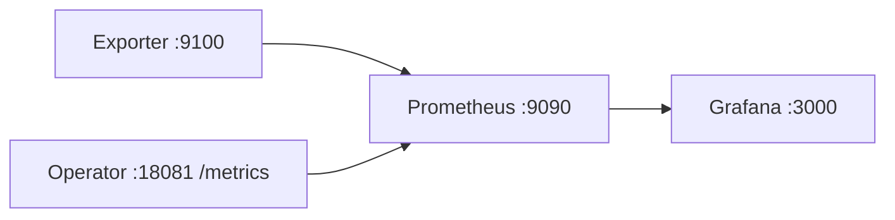

# 可观测性（P5-Obs）

> Grafana **只读**演示栈；自愈写路径仍仅 Operator（ADR-0001 PromQL Pull 不变）。

## 架构



| 组件 | 端口 | 说明 |
|------|------|------|
| gpu-metrics-exporter | 9100 | `gpu_xid_errors_total`，`POST /inject/xid` |
| ai-operator | **18081** | `operator_up`、`healing_actions_total`…（与 `demo.sh` 默认 `METRICS_LISTEN` 一致） |
| Prometheus | 9090 | scrape Exporter + Operator（Docker → `host.docker.internal`） |
| Grafana | 3000 | 预置 Dashboard **AI 平台自愈监控** |

## 本地启动顺序

**终端 1 — 指标源**

```bash
make build
./bin/exporter &
export METRICS_LISTEN=:18081
export PROMETHEUS_MOCK=true PROMETHEUS_MOCK_NODES=<your-node>
export HEALING_DRY_RUN=false POLL_INTERVAL=8s
go run ./cmd/operator &
```

**终端 2 — 观测栈**

```bash
./scripts/observability-stack.sh up
./scripts/prometheus/start-prometheus.sh check
./scripts/grafana/start-grafana.sh check
```

**终端 3 — 触发故障（二选一）**

```bash
curl -X POST 'http://localhost:9100/inject/xid?node=<node>&gpu_id=0&xid_code=79'
# 或
./scripts/demo.sh
```

**验证**

- Prometheus <http://localhost:9090/targets>：`gpu-metrics-exporter` 与 `ai-operator` 均为 **UP**
- Grafana <http://localhost:3000>：`operator_up = 1`；demo 后 `healing_actions` 曲线有 cordon/taint/evict

**清理**

```bash
./scripts/observability-stack.sh down
kill %1 %2 2>/dev/null || true
```

## 与 ADR-0001

- **决策不变：** 控制面仅 PromQL Pull 触发 healing。  
- **Grafana：** 只看 Prometheus，不做 Cordon/Evict 写操作，避免双写与权限膨胀。

## 面试话术（30 秒）

控制面是 Go Operator：PromQL Pull 发现 GPU XID，走 healing 状态机做 Cordon、Taint、Evict，Job 控制器负责重建。可观测不造轮子：Operator 暴露 Prometheus 指标，与 Exporter 一并被 Prometheus scrape，Grafana **只看不动**——没有第二套写 API 的控制台，和生产 SRE 栈一致。

**若问「为什么不用自研前端」：** 自愈写路径只有 Operator；UI 用 Grafana 降低权限与双写风险，面试演示和值班大盘够用。

## 故障排查

| 现象 | 处理 |
|------|------|
| target `ai-operator` **DOWN** | 宿主机是否 `METRICS_LISTEN=:18081` 且进程在跑；`curl localhost:18081/metrics` |
| target `gpu-metrics-exporter` **DOWN** | `./bin/exporter` 是否监听 :9100 |
| Grafana 无数据 | 数据源是否指向 Prometheus；时间范围 Last 15m |
| `envsubst: command not found` | 安装 `gettext`（Arch: `gettext`，Debian: `gettext-base`） |

## 相关脚本

- `scripts/prometheus/start-prometheus.sh` — `OPERATOR_METRICS_HOST` / `EXPORTER_METRICS_HOST`
- `scripts/grafana/start-grafana.sh`
- `scripts/observability-stack.sh` — 一键 up/down/status
