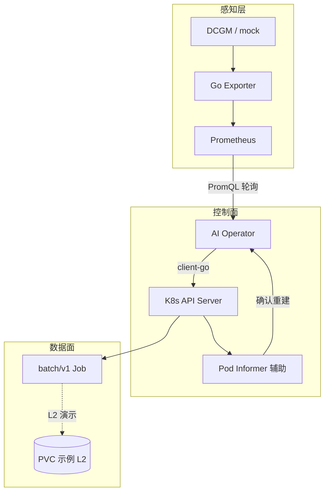
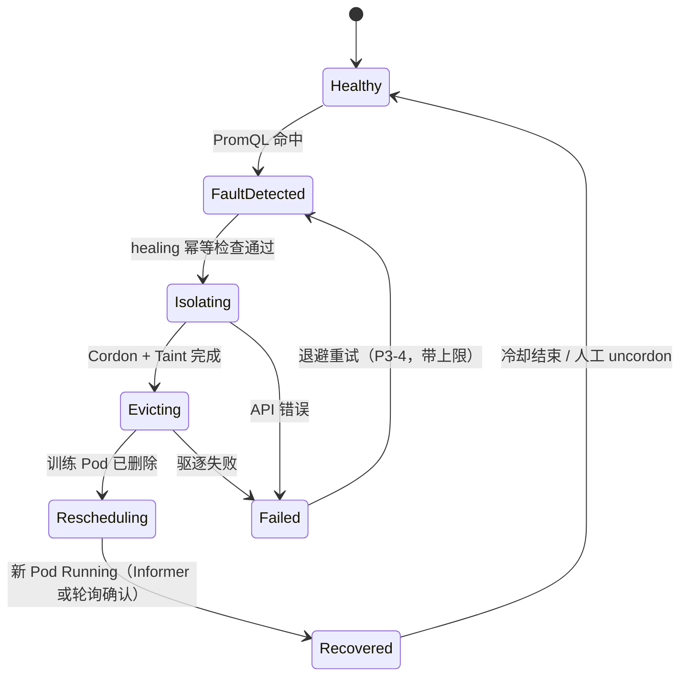

# AI-k8s-Platform 项目计划

> **版本：** v1.2  
> **更新日期：** 2026-05-21  
> **状态：** 规划 / 脚手架已就绪，核心代码待开发  
> **开发分支：** `dev`（日常开发）｜**稳定分支：** `main`  
> **变更说明：** v1.2 驱逐 API 默认、Operator 崩溃断点、P2 Plan B、§2.1 痛点、时间缓冲、CI 状态对齐

---

## 1. 项目概述

### 1.1 一句话

**机器冒烟前把任务捞出来，机器宕机后让任务自动复活。**

### 1.2 项目定位

基于 Kubernetes 的**自愈型 AI 算力平台**：将 GPU 底层硬件指标与 K8s 调度/工作负载管理打通，在节点硬件故障时由平台自动完成 **隔离节点 → 驱逐训练 Pod → 在健康节点由 Job 控制器重建 Pod**。

**平台 MVP 交付边界：** 上述编排与幂等；**不承诺**替训练框架实现梯度续训。  
**演示加分（示例）：** 提供挂载同一 PVC、读取约定 checkpoint 路径的示例 Job，证明「可续训」需训练镜像与路径约定（见 §1.4）。

### 1.3 目标用户与场景

| 角色 | 场景 |
|------|------|
| 平台 SRE | 减少半夜因单卡 XID/ECC/过热导致整 job 失败的手动 Cordon/驱逐 |
| 算法 / 训练工程师 | 故障后 Job 自动换节点；续训由框架 + Checkpoint 约定完成 |
| 面试 / 作品集 | 闭环 Operator + 可观测 + 与社区方案差异说明 |

### 1.4 成功标准（分级，避免过度承诺）

#### L1 — 平台 MVP（P2 必须验收）

| 指标 | 目标 |
|------|------|
| 故障发现 | **PromQL 定时轮询** mock/真实 `gpu_xid_errors_total`，周期内感知故障节点 |
| 节点隔离 | 触发后 **≤ 10s** 完成 Cordon + Taint |
| 工作负载恢复 | 带约定标签的训练 Pod 被驱逐后，`batch/v1` Job 在**另一节点**出现新 Pod 且进入 `Running` |
| 幂等 | 同一节点冷却期内不重复 Cordon/驱逐 |
| 可观测 | 结构化日志 + Operator `/metrics`（P3 前可用日志先行） |

#### L2 — 演示加分（P4，非平台能力承诺）

| 指标 | 目标 |
|------|------|
| Checkpoint 静态演示 | 示例 Job 挂载**同一 PVC**，容器启动脚本读取**固定路径**下 checkpoint 文件（可为空文件 touch） |
| 说明 | 续训逻辑在**训练镜像 / 框架**，平台只保证存储挂载与 Job 重建 |

**面试表述建议：** 「Operator 保证调度侧自愈；续训是示例 Job + PVC 契约，不是 Operator 魔法。」

---

## 2. 背景与痛点

### 2.1 业务痛点

- **长周期、多卡：** 训练常跑数周、占数百 GPU，中途不可预期中断。  
- **单点硬件故障扩散：** 一张卡 XID / ECC / 过热即可导致 NCCL 集体失败，整 job 退出。  
- **运维不可扩展：** SRE 靠告警人工 Cordon、查 Pod、重启、找 Checkpoint，无法支撑大规模集群。

### 2.2 本项目要解决的问题（平台侧）

1. **感知：** 指标进入 Prometheus，由 Operator **Pull PromQL** 发现故障节点。  
2. **决策与执行：** Operator 统一 Cordon / Taint / 驱逐。  
3. **恢复（K8s 层）：** Job 控制器重建 Pod。  
4. **恢复（训练层，非 MVP）：** Checkpoint 由示例与文档说明，不写入 Operator 核心逻辑。

### 2.3 非目标（Out of Scope，MVP 不做）

- 替代 Kubeflow / Volcano / Kueue / Slurm 的全套调度。  
- Operator **保证**断点续训或 NCCL 容错。  
- Alertmanager Webhook 驱动（Post-MVP）。  
- **零 CRD**；策略仅 ConfigMap + 环境变量（见 §5.3）。  
- GPU Operator 替代方案、多集群联邦、生产级 Grafana 大盘（P4 可选录屏用最小面板）。  
- Leader Election、Admission Webhook（Post-MVP）。

---

## 3. 系统架构

### 3.0 MVP 架构决策（控制面输入 — 已拍板）

| 模式 | MVP | 负责模块 | 延迟 | 重复触发 | 幂等负责方 |
|------|-----|----------|------|----------|------------|
| **PromQL 定时轮询** | ✅ **唯一入口** | `internal/prometheus` 查询 + `internal/healing` 状态机 | scrape 间隔 + 轮询周期（默认 30s） | 同节点可能多次命中 PromQL | **healing**：节点 `healing-state` 标签 + 冷却时间 |
| Alertmanager Webhook | ❌ Post-MVP | - | 秒级 | AM 分组/抑制需另设计 | 同上，需 Webhook handler |
| Informer 看 Node Condition | ❌ 非故障发现入口 | `internal/controller` | 实时 | NPD 等与 XID 不同源 | 不用于触发隔离，仅观测 |
| Informer 看 Pod | ⚠️ P2 辅助 | `internal/controller` | 实时 | Watch 重放 | 辅助验证重建，**不触发**驱逐 |

**P2 验收依赖路径：** Exporter(mock) → Prometheus → **Operator PromQL 轮询** → healing API → Job 重建；**不依赖** Alertmanager。

**为何不三种并行：** MVP 求可演示、可单测；Pull + mock 无需 AM/ingress；Webhook 与 Informer 触发留 Post-MVP ADR。

### 3.1 逻辑架构（MVP）



| 层级 | 组件 | 职责 |
|------|------|------|
| 感知层 | Exporter + Prometheus | 指标；MVP 用 mock，真机再接 DCGM |
| 控制面 | Operator（轮询 + healing） | 故障决策与 K8s 写操作 |
| 控制面辅助 | `internal/controller` | **仅** Pod Informer：驱逐后等待新 Pod Running |
| 数据面 | Job + 可选 PVC | K8s 重建；续训为示例契约 |

### 3.2 自愈核心链路（状态机）



| 步骤 | 动作 | 模块 | MVP |
|------|------|------|-----|
| 1 | PromQL 发现故障节点 | `internal/prometheus` | ✅ |
| 2 | Cordon + Taint | `internal/healing` | ✅ |
| 3 | 驱逐训练 Pod | `internal/healing` | ✅ |
| 4 | Job 新 Pod Running | K8s Job + `internal/controller` 确认 | ✅ |
| 5 | 读 Checkpoint 续训 | 训练容器 | L2 示例 only |

### 3.3 部署拓扑（MVP）

```
Namespace: ai-platform
├── DaemonSet: gpu-metrics-exporter (mock 可替代 dcgm)
├── Deployment: ai-operator (单副本)
├── ConfigMap: operator-config（策略、冷却、选择器）
├── ServiceAccount + ClusterRole(Binding)
└── Prometheus（脚本部署，非 Operator 子组件）

Namespace: ai-training（示例）
└── Job + PVC（L2）
```

**MVP 不部署：** Alertmanager、PrometheusRule（可选文档示例）、GPU Operator、CRD。

### 3.4 关键数据流（MVP）

1. **指标：** Exporter → Prometheus scrape。  
2. **决策：** Operator 每 `POLL_INTERVAL` 执行 PromQL → 节点列表 → `healing`（幂等 + dry-run）。  
3. **确认：** `controller` Pod Informer 见新 Pod `Running` → 写 Event / 指标。  
4. **驱逐范围：** `TRAINING_POD_LABEL_SELECTOR` + 可选 Namespace 列表（ConfigMap）。

---

## 4. 技术选型

| 类别 | MVP | Post-MVP |
|------|-----|----------|
| K8s 客户端 | **纯 `client-go`** + 单 goroutine 轮询 | controller-runtime + CRD |
| 故障输入 | **PromQL Pull** | + Alertmanager Webhook |
| 工作负载 | **`batch/v1` Job** | Volcano Job / PyTorchJob 适配器 |
| Exporter | **自研 mock**（面试叙事：可接 DCGM） | 与 NVIDIA DCGM Exporter 二选一或并存 |
| 配置 | **ConfigMap + env** | `HealingPolicy` CRD |

---

## 5. 代码与模块规划

### 5.1 目录与职责（与阶段对齐）

| 路径 | 职责 | 阶段 | 说明 |
|------|------|------|------|
| `internal/healing/` | Cordon、Taint、驱逐、幂等、冷却 | **P0–P2 主路径** | **控制面执行核心** |
| `internal/prometheus/` | PromQL、故障节点解析 | **P1–P2** | **控制面输入唯一来源** |
| `cmd/operator/` | 轮询循环、组装 healing | **P2** | 主进程 |
| `internal/controller/` | Pod Informer：驱逐后确认 Running | **P2**（非 P1） | **不触发**驱逐；解决「轮询无法确认重建」 |
| `cmd/exporter/` | mock 指标 | P1 | |
| `pkg/` | 标签/污点常量 | P1 | |
| `api/` | CRD | **Post-MVP** | MVP **零 CRD** |
| `deploy/manifests/` | RBAC、Deployment、ConfigMap | P0 起 | |

**主从关系：** `prometheus`（输入）→ `operator` 循环 → `healing`（写 K8s）→ `controller`（读 Pod 确认）；**healing 主导，controller 只读辅助**。

### 5.2 标签与约定

（同 v1.0：训练 Pod 标签、污点键、`healing-state` 标签用于幂等。）

### 5.3 MVP 配置策略（零 CRD）

| 配置载体 | 内容 |
|----------|------|
| ConfigMap `operator-config` | `poll_interval`, `cooldown`, `label_selector`, `target_namespaces` |
| 环境变量 | `PROMETHEUS_URL`, `HEALING_DRY_RUN`, `PROMETHEUS_MOCK` |
| 文档示例 | `PrometheusRule` 仅作 **docs/examples**，**不是** P2 验收条件 |

---

## 6. 接口与可观测设计

### 6.1 Exporter 指标（规划）

| 指标名 | 类型 | 说明 |
|--------|------|------|
| `gpu_xid_errors_total` | Counter | `node`, `gpu_id`, `xid_code` |
| `gpu_temperature_celsius` | Gauge | 可选 |
| `gpu_ecc_errors_total` | Counter | 可选 |

**MVP PromQL 示例：** `increase(gpu_xid_errors_total[5m]) > 0`

### 6.2 Operator 指标

| 指标名 | 说明 |
|--------|------|
| `healing_actions_total` | `action`, `result`, `node` |
| `healing_duration_seconds` | 单次链路耗时 |
| `healing_last_success_timestamp` | 排障：上次成功时间 |
| `operator_up` | 1=进程正常；**为 0 时外部告警**（见 §6.5） |

### 6.3 日志字段规范（每次自愈 attempt）

| 字段 | 说明 |
|------|------|
| `action_id` | UUID，串联一次自愈 |
| `node` | 目标节点 |
| `xid` / `promql` | 触发证据 |
| `action` | `cordon` / `taint` / `evict` / `verify` |
| `dry_run` | bool |
| `result` | `ok` / `err` |
| `error` | 失败详情 |

### 6.4 配置项

| 变量 | 默认 | 说明 |
|------|------|------|
| `POLL_INTERVAL` | `30s` | PromQL 轮询 |
| `HEALING_COOLDOWN` | `10m` | 同节点重复隔离冷却 |
| `PROMETHEUS_URL` | - | 必填 |
| `HEALING_DRY_RUN` | `true` | |
| `TARGET_NAMESPACES` | `ai-training` | 逗号分隔；空=集群内带标签即处理 |

### 6.5 排障路径（MVP）

| 现象 | 查什么 | 动作 |
|------|--------|------|
| 未隔离 | Operator 日志 `action_id`、PromQL 是否命中 | 调 mock 指标；查 `HEALING_DRY_RUN` |
| 未驱逐 | RBAC、`label_selector` | `kubectl describe pod` |
| 未重建 | Job 存在吗、资源是否够 | `controller` 是否等到 Running |
| Operator 挂了 | `operator_up`、Deployment 事件 | 重启 Deployment；**MVP 不自愈 Operator 进程本身**（无副本选主） |
| 误隔离 | Node 标签 `healing-state` | **人工** `scripts/uncordon.sh`（P3 交付） |

#### Operator 进程崩溃与恢复（MVP）

**问题：** 轮询循环中途 OOM/Kill 后，内存态丢失，会否重复 Cordon 或漏驱逐？  
**策略：** 以 Node 标签 `ai-k8s-platform.io/healing-state` 作为**持久断点**（写在 etcd，非 Operator 内存）：

| `healing-state` | 含义 | 重启后行为 |
|-----------------|------|------------|
| `""` / 无 | 未处理 | 从 Cordon 开始 |
| `cordoned` | 已 Cordon | 跳过 Cordon，继续 Taint |
| `tainted` | 已 Taint | 跳过 Cordon/Taint，进入驱逐 |
| `evicted` | 驱逐完成 | 跳过写操作，仅 `controller`/轮询确认新 Pod |
| `completed` | 本轮结束 | 冷却期内不再处理（配合 `HEALING_COOLDOWN`） |

每完成一步即 patch Node 标签；重启后**读标签续跑**，避免重复 API。面试表述：「进程无 HA，但**工作流幂等**靠 Node 标签断点，类似粗粒度 saga。」Post-MVP 再考虑 Leader Election + lease。

**Grafana：** P4 **可选**（录屏用 1 面板即可）；**不是** MVP 必交付。

### 6.6 PrometheusRule

仅 `docs/examples/prometheus-rule.yaml`；P2 **不验收** Alertmanager/Rule 是否部署。

---

## 7. 安全、RBAC、审计与多租户

### 7.1 Operator RBAC（ClusterRole，MVP）

| 资源 | Verbs | 用途 |
|------|-------|------|
| `nodes` | get, list, watch, patch, update | Cordon、Taint、Label |
| `pods` | get, list, watch, delete | 驱逐兜底（Eviction 失败时） |
| `pods/eviction` | create | **MVP 默认** `policy/v1` Eviction |
| `events` | create, patch | **审计留痕（P2-6 必做）** |

**范围：** MVP 使用 ClusterRole，但代码**仅处理** `TARGET_NAMESPACES` 内带标签 Pod；文档说明「权限大、逻辑收窄」。

### 7.2 故障注入（mock XID）权限

| 操作 | 谁 | MVP |
|------|-----|-----|
| `curl` 调 Exporter 加 counter | 开发脚本 / CI SA | 仅文档；**禁止**生产 ClusterRole 给人类 curl |
| `kubectl` 改 Node | 仅 Operator SA | |

### 7.3 审计与回滚

| 项 | MVP 任务 |
|----|----------|
| Kubernetes Events | P2-6：每步 healing 写 `Event` 到 Node/Job |
| 回滚 uncordon | P3-6：`scripts/uncordon.sh` + 文档「谁批准」：MVP 默认**集群 admin 人工** |
| Audit Log | 依赖集群 Audit Policy；文档说明 Operator SA 操作可查 |
| 多 Namespace | ConfigMap `target_namespaces`；面试说明为何不 Per-NS Operator |

### 7.4 面试话术（安全）

「MVP 用 ClusterRole 但选择器收窄；误操作靠 dry-run + 冷却 + 人工 uncordon；生产会拆 SA、加 Webhook 审批 Post-MVP。」

---

## 8. 分阶段实施计划

### 8.0 阶段 Gate（测试必须先绿）

| 阶段 | 合并前 Gate |
|------|-------------|
| P0 | `go test ./internal/healing/...` **全绿** + coverage ≥ 60% |
| P1 | `go test ./internal/prometheus/...` **全绿** + coverage ≥ 60% |
| P2 | 上述 + `scripts/e2e-kind.sh` **一条命令绿** |
| P3 | 上述 + 失败注入用例在 e2e 中 |
| P4 | CI on `dev` 绿 + 文档与 §16.4 快照一致 |

---

### 阶段总览

| 阶段 | 名称 | 周期（参考） | 滑动 |
|------|------|--------------|------|
| **P0** | K8s API + healing 单测 | 1–2 周 | 固定 |
| **P1** | mock 指标 + PromQL | 1 周 | 固定 |
| **P2** | 闭环 MVP（L1 验收） | 2 周 | 见 Plan B 脚注 |
| **P3** | 硬化 + e2e + 回滚脚本 | 1 周 | **可顺延 1 周** |
| **P4** | 演示 L2 + 面试稿 + 合并 main | 1 周 | **可顺延 1 周** |
| **缓冲** | 联调 / 面试准备 | **+1 周** | 默认吃进 P3–P4 滑动，不砍 L1 |

**合计：** 约 **6–7 周** 开发 + **1 周缓冲** → 对外可说 **7–8 周**（含 P3/P4 可整体后移 1 周仍交付 L1）。

---

### P0：K8s API 能力

| 任务 ID | 任务 | 验收标准 |
|---------|------|----------|
| P0-1 | `Cordon` | fake client 单测 + kind 可选 |
| P0-2 | `Taint` / `Label` | 同上 |
| P0-3 | 幂等：`ai-k8s-platform.io/healing-state` Node 标签 | 重复调用按 §6.5 状态跳过；**禁止**仅用内存态 |
| P0-4 | RBAC 清单 | `kubectl auth can-i` 通过 |
| P0-5 | **Gate** | `go test ./internal/healing/... -cover` ≥ 60% **必须先绿** |

---

### P1：Prometheus + Mock

| 任务 ID | 任务 | 验收标准 |
|---------|------|----------|
| P1-1 | Exporter mock `/metrics` | curl 可见 counter |
| P1-2 | PromQL 客户端 | 单测：给定 node 返回 fault |
| P1-3 | Prometheus 本地部署脚本 | scrape 成功 |
| P1-4 | Rule **仅** `docs/examples/` | **不**作为 P1 验收 |
| P1-5 | **Gate** | prometheus 包 coverage ≥ 60% **必须先绿** |

---

### P2：自愈闭环（L1）

**前置：** §3.0 路径锁定；**零 CRD**。

| 任务 ID | 任务 | 验收标准 |
|---------|------|----------|
| P2-1 | Operator：**仅** PromQL 轮询主循环 | 日志含 `action_id`、命中 node |
| P2-2 | healing 串联 Cordon→Taint→驱逐 | 坏节点训练 Pod 消失；驱逐 **默认** `policy/v1` **Eviction**，API 拒绝或超时时 **fallback `Delete`**（见 §7.1） |
| P2-3 | `internal/controller` Pod Informer | 新 Pod `Running` 写 Event/日志 |
| P2-4 | 示例 `batch/v1` Job | 新节点 Running（**L1**） |
| P2-5 | 幂等 + 冷却 ConfigMap | 连续触发不重复驱逐 |
| P2-6 | Kubernetes Events 审计 | `kubectl get events` 可见 |
| P2-7 | **Gate** | `scripts/e2e-kind.sh` 全绿 **必须先绿** |

**P2 不验收：** Alertmanager、CRD、Checkpoint 训练进程真续训。

> **Plan B（若 P2 延期 1 周仍不够）：** 先交付 **PromQL + Cordon + Eviction/Delete 驱逐 + Job 在新节点 Running**（L1 最小路径）；**Taint** 与 **Pod Informer 确认** 后置到 P3 开头；e2e 暂用脚本轮询 `kubectl get pod` 代替 Informer，**不砍** L1 验收意图。

---

### P3：硬化

| 任务 ID | 任务 | 验收标准 |
|---------|------|----------|
| P3-1 | `/metrics` + `operator_up` | scrape 成功 |
| P3-2 | 结构化日志 §6.3 | 字段齐全 |
| P3-3 | `HEALING_DRY_RUN` 全链路 | |
| P3-4 | Failed→重试退避 + 上限 | 单测覆盖 |
| P3-5 | `scripts/uncordon.sh` + 文档 | 人工回滚步骤 |
| P3-6 | e2e 纳入 CI（`dev` 分支） | 见 §16 |

---

### P4：演示与合并

| 任务 ID | 任务 | 验收标准 |
|---------|------|----------|
| P4-1 | `scripts/demo.sh` | 含 L1；可选 L2 PVC 步骤 |
| P4-2 | `docs/interview-pitch.md` | 含 §9 社区差异话术 |
| P4-3 | Grafana **可选** 单面板 | 不阻塞合并 |
| P4-4 | `dev`→`main` PR | CI 绿 |

---

## 9. 与社区方案差异（为何自研 Operator）

| 社区能力 | 做什么 | 与本项目关系 |
|----------|--------|----------------|
| **NVIDIA DCGM Exporter**（官方） | 暴露 GPU 指标 | MVP **mock**；Post-MVP **可替换自研 Exporter**，Operator **不重复**采集 |
| **Node Problem Detector (NPD)** | 节点状况 → Condition | 偏通用节点故障；**不专门处理 GPU XID→训练驱逐闭环**；可 Post-MVP 作补充信号，**不**作 MVP 输入 |
| **cluster-autoscaler** | 节点不足时扩容 | 对 **已 Cordon** 节点不修复训练 Pod；本项目管**工作负载迁移**，非扩缩容 |
| **GPU Operator** | 驱动、Device Plugin、DCGM 部署 | 集群底座；本平台是**上层编排**，与之互补 |
| **Volcano / Kueue** | 队列、gang、配额 | MVP 用 **`batch/v1` Job** 降低复杂度；Post-MVP 适配 VolcanoJob |
| **仅 Prometheus 告警 + 人工 runbook** | 告警 | 无自动 Cordon/驱逐；本项目价值在 **closed-loop** |

**面试一句：** 「Exporter 可换成官方的；核心是 **Prometheus 信号 + 专用 healing 状态机 + Job 级恢复**，NPD/CA 解决不了训练 Pod 自动迁走。」

---

## 10. 测试策略（与 §8 Gate 绑定）

| 层级 | 阶段 | 工具 |
|------|------|------|
| 单元 | P0/P1 **Gate** | fake clientset, table-driven |
| 集成 | P2 **Gate** | `scripts/e2e-kind.sh` |
| 故障注入 | P3 | curl Exporter + e2e 断言 Events |

**禁止：** P2 功能合入时 healing/prometheus 单测未绿；**禁止** P3 才首次写 e2e。

---

## 11. 环境与工具链

（同 v1.0：`git checkout dev`、`make build/test`。）

---

## 12. 风险与应对

| 风险 | 应对 |
|------|------|
| 三种输入源混淆 | §3.0 已拍板 Pull only |
| controller 与 healing 职责重叠 | §5.1 主从分明 |
| 续训过度承诺 | §1.4 L1/L2 分级 |
| 告警风暴 | 冷却 + healing-state 标签（P2-5） |
| Operator 单点 | `operator_up` 告警；Leader Election Post-MVP |
| P2 排期延误 | **§8 P2 Plan B**：先 Cordon+驱逐+Job 重建；Taint/Informer 后置 P3；P3/P4 可滑动 1 周 |

---

## 13. 文档清单

| 文档 | 路径 | 状态 |
|------|------|------|
| 产品初衷 | `说明文档.txt` | ✅ |
| 本计划 | `项目计划.md` | ✅ v1.2 |
| ADR-0001 | `docs/adr/0001-mvp-promql-pull-only.md` | ✅ |
| 演示手册 | `docs/demo-runbook.md` | ⬜ P4 |
| 面试话术 | `docs/interview-pitch.md` | ⬜ P4（含 §9） |
| CHANGELOG | `CHANGELOG.md` | ⬜ 首版 P4 |

---

## 14. 面试叙事（修订）

> 我实现了一个 **GPU 故障闭环 Operator**：MVP 用 **PromQL 轮询 + mock XID** 发现故障节点，**client-go** 完成 Cordon、污点与训练 Pod 驱逐，并用 Pod Informer **确认 Job 在新节点 Running**。若排期紧，**最小路径**可先 **Cordon + Eviction 驱逐**（Plan B，Taint/Informer 后置），L1 验收仍是 Job 在新节点 Running。平台交付的是**调度侧自愈**；断点续训在示例 Job 的 PVC 契约里演示，不夸大 Operator 能力。与 NPD、Cluster Autoscaler、官方 DCGM Exporter 分工不同：我补的是 **指标 → 编排 → 工作负载迁移** 这一段。

---

## 15. Post-MVP 演进

1. Alertmanager Webhook → Operator（与 Pull 二选一或并存，需 ADR）  
2. `HealingPolicy` CRD（**从 MVP 零 CRD 升级**）  
3. Leader Election、Admission Webhook  
4. 官方 DCGM Exporter 对接  
5. Volcano / Kueue Job 适配  
6. NPD Condition 作为辅助输入  

---

## 16. 文档治理、CI 与进度同步

### 16.1 CI

| 项 | 约定 |
|----|------|
| 触发分支 | **`dev` 与 `main`** 均跑 `go test` + `make build` |
| P3 起 | 增加 `e2e-kind`（可 `continue-on-error` 直到稳定后 required） |
| PR | `dev` → `main` 前 CI 必须绿 |

**风险：** 仅 CI `main` 会导致 `dev` 长期红灯无人知——故 **双分支**。

### 16.2 ADR / CHANGELOG

- 架构拍板见 `docs/adr/0001-mvp-promql-pull-only.md`（✅ 已落地，与 §3.0 一致）。  
- 用户可见变更记 `CHANGELOG.md`（P4 起维护）。

### 16.3 本计划维护

| 机制 | 说明 |
|------|------|
| §16.4 快照表 | 每完成 Px Gate，更新状态与日期 |
| 周更 | 每周或每阶段结束更新 §16.4 + 勾选附录 B |
| 实现偏离 | 先改 ADR，再改本文档 §3/§8 |

### 16.4 当前进度快照（2026-05-21）

| 项 | 状态 |
|----|------|
| 脚手架 | ✅ |
| §3.0 MVP 决策 | ✅ v1.2 |
| **P0** | ✅ Gate 通过（healing 单测 79.3%） |
| **P1** | ✅ Gate 通过（prometheus 79.6%） |
| **P2** | ✅ **L1-A Plan B**（e2e-k3s 绿）；**L1-B 严格换节点** → P3 |
| P3–P4 代码 | ⬜ 见 [docs/p2-acceptance.md](docs/p2-acceptance.md) |
| ADR-0001 | ✅ |
| CHANGELOG | ⬜ P4 |
| CI on `dev` | ✅ `.github/workflows/ci.yml` 已含 `dev`/`main`；e2e 进 CI 仍 ⬜ P3-6 |

**下一步：** P1 mock Exporter + PromQL 客户端。

---

## 附录 A：文档关系

```
说明文档.txt → 动机
项目计划.md  → 实施与面试边界（本文档）
docs/adr/0001-... → ADR-0001 PromQL Pull（已接受）
README.md    → 对外摘要
```

## 附录 B：里程碑检查表

- [ ] P0 Gate：healing 单测 ≥60% 绿  
- [x] P1 Gate：prometheus 单测 ≥60% 绿  
- [x] P2 Gate（L1-A）：e2e-k3s 绿（Plan B，2026-05-21）  
- [ ] P2 补验（L1-B）：e2e-kind 2 节点 + 真 PromQL + 集群内 Operator → **P3**  
- [ ] P2-6：Events 审计  
- [ ] P3：uncordon 脚本 + 退避 + CI dev  
- [ ] P4：L2 PVC 示例可选 + ADR + CHANGELOG  
- [ ] Post-MVP：Webhook / CRD  

---

*v1.2：驱逐 API 默认、healing-state 崩溃断点、P2 Plan B、痛点正文、7–8 周含缓冲、CI 状态与仓库一致。*
