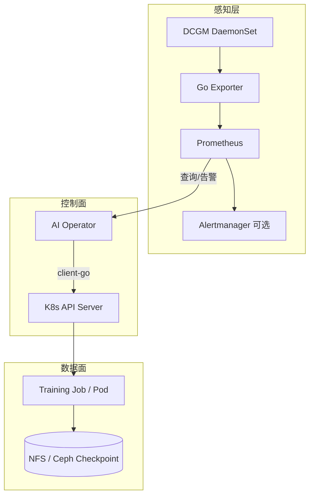
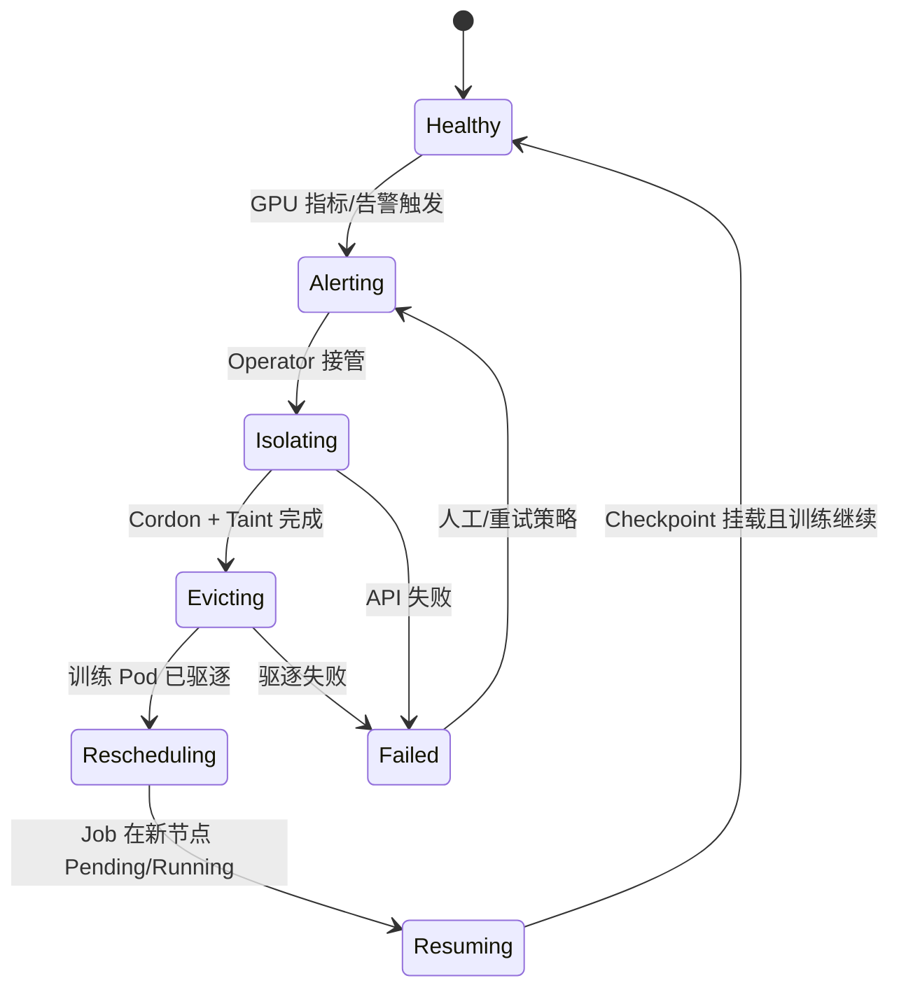

# AI-k8s-Platform 项目计划

> **版本：** v1.0  
> **更新日期：** 2026-05-21  
> **状态：** 规划 / 脚手架已就绪，核心代码待开发  
> **开发分支：** `dev`（日常开发）｜**稳定分支：** `main`

---

## 1. 项目概述

### 1.1 一句话

**机器冒烟前把任务捞出来，机器宕机后让任务自动复活。**

### 1.2 项目定位

基于 Kubernetes 的**自愈型 AI 算力平台**：将 GPU 底层硬件指标（DCGM）与 K8s 调度/工作负载管理打通，在节点硬件故障时自动**隔离节点 → 驱逐任务 → 在健康节点重建 → 从 Checkpoint 断点续训**，降低大规模训练集群的人工运维成本。

### 1.3 目标用户与场景

| 角色 | 场景 |
|------|------|
| 平台 SRE | 减少半夜因单卡 XID/ECC/过热导致整 job 失败的手动重启 |
| 算法 / 训练工程师 | 长周期多卡训练在硬件故障后自动恢复，减少算力浪费 |
| 面试 / 作品集 | 展示闭环 Operator + 可观测 + 工程化落地能力 |

### 1.4 成功标准（项目级）

| 指标 | 目标（MVP 阶段可演示） |
|------|------------------------|
| 故障发现 | Prometheus 在模拟/真实 XID 指标触发后 **≤ 30s** 被 Operator 感知 |
| 节点隔离 | 触发后 **≤ 10s** 完成 Cordon + Taint |
| 任务恢复 | 驱逐后 Job 在健康节点拉起新 Pod，**≤ 5min**（依赖镜像与调度） |
| 断点续训 | 新 Pod 能挂载共享存储上**最近一次** Checkpoint 并继续训练（需训练侧配合） |
| 可观测 | 关键步骤有日志 + Prometheus 指标（自愈次数、耗时、失败原因） |

---

## 2. 背景与痛点

### 2.1 业务痛点

- 大模型训练常持续 **数周**，占用 **数百张 GPU**。
- 单张 GPU 硬件故障（温度过高、ECC 错误、**XID** 等）可导致 **NCCL 集体通信失败**，整 job 退出。
- SRE 依赖告警人工介入：Cordon、查 Pod、重启、找 Checkpoint——**不可扩展**。

### 2.2 本项目要解决的问题

1. **感知：** 从「事后 job 挂了」提前到「硬件指标异常 / 告警」。
2. **决策：** 由 Operator 统一决策，而非人工脚本。
3. **执行：** 自动隔离坏节点、驱逐受影响训练 Pod。
4. **恢复：** 借助 K8s Job 控制器 + 共享存储 Checkpoint 完成**分钟级**自愈。

### 2.3 非目标（Out of Scope，MVP 不做）

- 替代 Kubeflow / Volcano / Slurm 等训练调度框架的全套能力。
- GPU 虚拟化、MIG 细粒度调度策略的完整产品化。
- 多集群联邦、跨机房流量调度。
- 训练框架内部的梯度同步容错（仅依赖 Checkpoint 续训）。
- 生产级 UI 大盘（可先 Grafana + 日志）。

---

## 3. 系统架构

### 3.1 逻辑架构（三层）



| 层级 | 组件 | 职责 |
|------|------|------|
| **感知层** | DCGM DaemonSet、Go Exporter、Prometheus | 采集 GPU 硬件指标，产生告警条件 |
| **控制面** | Custom Operator | 监听指标与 Pod/Node 状态，编排自愈 |
| **数据面** | Job、训练 Pod、共享存储 | 任务运行与 Checkpoint 持久化 |

### 3.2 自愈核心链路（状态机）



| 步骤 | 动作 | 负责模块 |
|------|------|----------|
| 1. 预警 | Prometheus 告警，如 Node GPU `XID 79` | `internal/prometheus` + 规则 |
| 2. 隔离 | `Cordon` + 自定义 `Taint` | `internal/healing` |
| 3. 驱逐 | 删除/驱逐该节点上训练 Pod | `internal/healing` |
| 4. 复活 | Job 控制器在健康节点创建 Pod | K8s 原生 + 调度器 |
| 5. 续训 | 新 Pod 挂载最新 Checkpoint | 训练镜像 + PVC |

### 3.3 部署拓扑（目标态）

```
Namespace: ai-platform (建议)
├── DaemonSet: dcgm
├── DaemonSet: gpu-metrics-exporter
├── Deployment: ai-operator (单副本或 leader-election 后续再加)
├── ServiceMonitor / PrometheusRule (若用 Prometheus Operator)
├── ServiceAccount + ClusterRole(Binding)
└── 训练 Namespace (可复用 default 或 ai-training)
    └── Job / Pod + PVC (checkpoint)
```

### 3.4 关键数据流

1. **指标上行：** DCGM → Exporter `:port/metrics` → Prometheus scrape。
2. **决策下行：** Operator 定时 PromQL / 接收告警 → 解析 `node` 标签 → 调 K8s API。
3. **工作负载：** Operator 只驱逐带约定标签的训练 Pod（避免误杀系统 Pod）。

---

## 4. 技术选型

| 类别 | 选型 | 说明 |
|------|------|------|
| 语言 | Go 1.22+ | 与 K8s 生态一致 |
| K8s 客户端 | `client-go`（一期） / kubebuilder（二期可选） | 一期快速闭环；二期 CRD 再引入 controller-runtime |
| 指标 | NVIDIA DCGM + 自研 Exporter | 面试亮点：不止调 API，有硬件指标链路 |
| 监控 | Prometheus (+ Alertmanager 可选) | 本地 kind/minikube + mock 指标 |
| 存储 | NFS 或 Ceph PVC | Checkpoint 路径需在 Job 模板中约定 |
| 本地集群 | kind / minikube | 开发验证 |
| CI | GitHub Actions | 已有 `go test` + `make build` |

---

## 5. 代码与模块规划

### 5.1 目录与职责

| 路径 | 职责 | 优先级 |
|------|------|--------|
| `cmd/operator/` | Operator 入口、信号处理、配置加载 | P0 |
| `cmd/exporter/` | DCGM/模拟指标 HTTP 暴露 | P1 |
| `internal/healing/` | Cordon、Taint、驱逐、幂等 | P0 |
| `internal/prometheus/` | PromQL、告警解析、mock | P0 |
| `internal/controller/` | Informer / Reconcile（Pod、Node） | P1 |
| `api/` | 可选 CRD：`GPUFaultEvent`、`HealingPolicy` | P2 |
| `pkg/` | 公共类型、标签常量 | P1 |
| `deploy/manifests/` | RBAC、DaemonSet、Deployment、PrometheusRule | P0 |
| `scripts/` | 本地 kind 安装、mock 故障注入 | P1 |

### 5.2 标签与约定（需在代码中常量定义）

**训练 Pod 选择器（示例）：**

- `ai-k8s-platform.io/training: "true"`
- 或通过 `job-name` 关联 Job

**节点污点（示例）：**

- Key: `ai-k8s-platform.io/gpu-fault`
- Effect: `NoSchedule`
- Value: `xid-79` 或时间戳

**节点标签（示例）：**

- `ai-k8s-platform.io/healing-state: isolating|evicted|cleared`

---

## 6. 接口与可观测设计

### 6.1 Prometheus 指标（Exporter 暴露，规划）

| 指标名 | 类型 | 说明 |
|--------|------|------|
| `gpu_xid_errors_total` | Counter | 按 `node`, `gpu_id`, `xid_code` |
| `gpu_temperature_celsius` | Gauge | 预警用 |
| `gpu_ecc_errors_total` | Counter | 可选 |

### 6.2 告警规则（示例）

```yaml
# 规划放入 deploy/manifests/prometheus-rules.yaml
- alert: GPUHardwareXID
  expr: increase(gpu_xid_errors_total[5m]) > 0
  for: 1m
  labels:
    severity: critical
  annotations:
    summary: "GPU XID on {{ $labels.node }}"
```

### 6.3 Operator 对外指标（规划）

| 指标名 | 说明 |
|--------|------|
| `healing_actions_total` | 按 `action`, `result` 计数 |
| `healing_duration_seconds` | 自愈链路耗时直方图 |
| `nodes_isolated_current` | 当前被隔离节点数 |

### 6.4 配置项（环境变量 / ConfigMap）

| 变量 | 默认值 | 说明 |
|------|--------|------|
| `PROMETHEUS_URL` | - | PromQL 端点 |
| `PROMETHEUS_MOCK` | `false` | 本地 mock |
| `HEALING_DRY_RUN` | `true` | 仅日志不执行 API |
| `TRAINING_POD_LABEL_SELECTOR` | 见 5.2 | 驱逐范围 |
| `FAULT_TAINT_KEY` | `ai-k8s-platform.io/gpu-fault` | 污点键 |

---

## 7. RBAC 规划（Operator）

| 资源 | Verbs | 用途 |
|------|-------|------|
| `nodes` | get, list, watch, patch, update | Cordon、Taint、Label |
| `pods` | get, list, watch, delete | 驱逐训练 Pod |
| `pods/eviction` | create | 优雅驱逐（可选） |
| `events` | create, patch | 记录自愈事件 |

---

## 8. 分阶段实施计划

### 阶段总览

| 阶段 | 名称 | 周期（参考） | 产出 |
|------|------|--------------|------|
| **P0** | 基础与 K8s API | 1–2 周 | Node 隔离 CLI/库 + 单元测试 |
| **P1** | 指标与 Mock | 1 周 | Exporter mock + PromQL 消费 |
| **P2** | 自愈闭环 MVP | 2 周 | Operator 串联 Cordon→驱逐→Job 重建 |
| **P3** | 可观测与硬化 | 1 周 | 指标、日志、幂等、dry-run |
| **P4** | 演示与文档 | 1 周 | kind 一键演示、录屏脚本、面试稿 |

---

### P0：K8s API 能力（当前首要）

**目标：** 不依赖 Prometheus，先证明能正确操作 Node。

| 任务 ID | 任务 | 交付物 | 验收标准 |
|---------|------|--------|----------|
| P0-1 | `internal/healing`：实现 `Cordon(node)` | Go API + 测试 | 对 kind 节点 `Unschedulable=true` |
| P0-2 | 实现 `Taint(node, key, value)` | 同上 | `kubectl describe node` 可见污点 |
| P0-3 | 实现 `Label(node, k, v)` | 同上 | 标签可读写 |
| P0-4 | `cmd/operator` 子命令或临时 main：手动触发 | `make run-heal -- --node x` | 本地一条命令可演示 |
| P0-5 | RBAC 草稿 | `deploy/manifests/operator-rbac.yaml` | 权限最小化 |

**风险：** 本地无真实 GPU → 用 kind + 普通节点模拟。

---

### P1：Prometheus 与 Mock 指标

**目标：** Operator 能「认为」某节点 GPU 故障。

| 任务 ID | 任务 | 交付物 | 验收标准 |
|---------|------|--------|----------|
| P1-1 | `cmd/exporter` 暴露 mock 指标 | HTTP `/metrics` | `curl` 可见 `gpu_xid_errors_total` |
| P1-2 | `internal/prometheus`：PromQL 查询 | Client + 测试 | 给定 node 返回是否故障 |
| P1-3 | Prometheus 部署清单 / docker-compose | `deploy/` 或 `scripts/` | 本地 scrape 成功 |
| P1-4 | `PrometheusRule` 或 Operator 内阈值 | 告警文档 | 文档记录触发条件 |

---

### P2：自愈闭环 MVP（核心）

**目标：** 端到端演示「故障 → 隔离 → 驱逐 → 新 Pod」。

| 任务 ID | 任务 | 交付物 | 验收标准 |
|---------|------|--------|----------|
| P2-1 | Operator 主循环：轮询故障节点列表 | `cmd/operator` | 日志打印待处理 node |
| P2-2 | 串联：Cordon → Taint → 驱逐 | `internal/healing` | 坏节点上训练 Pod 消失 |
| P2-3 | 示例 Training Job + 标签约定 | `deploy/manifests/examples/training-job.yaml` | Job 在新节点重建 |
| P2-4 | Checkpoint PVC 示例 | 示例 YAML + README 说明 | 新 Pod 挂载同 PVC（静态演示即可） |
| P2-5 | 幂等：同一节点不重复驱逐 | 单元测试 | 连续两次触发无副作用 |

---

### P3：可观测与生产向硬化

| 任务 ID | 任务 | 交付物 | 验收标准 |
|---------|------|--------|----------|
| P3-1 | Operator 暴露 `/metrics` | Prometheus 可 scrape | Grafana 可选 |
| P3-2 | 结构化日志（zap/logr） | 统一 logger | 每步有 trace id / node |
| P3-3 | `HEALING_DRY_RUN` 全链路 | 配置文档 | dry-run 不调危险 API |
| P3-4 | 失败重试与退避 | healing 包 | API 429/超时可恢复 |
| P3-5 | 集成测试（envtest 或 kind） | `tests/e2e/` | CI 可选手动 job |

---

### P4：演示、面试与合并

| 任务 ID | 任务 | 交付物 | 验收标准 |
|---------|------|--------|----------|
| P4-1 | `scripts/demo.sh` 一键演示 | 脚本 | 5–10 分钟可录屏 |
| P4-2 | 更新 README + architecture | 文档 | 与实现一致 |
| P4-3 | 面试叙事一页纸 | `docs/interview-pitch.md` | 含亮点话术 |
| P4-4 | `dev` → `main` PR | 合并记录 | CI 绿 |

---

## 9. 测试策略

| 层级 | 范围 | 工具 |
|------|------|------|
| 单元测试 | healing、prometheus 纯逻辑 | `go test` + table-driven |
| API 测试 | client-go fake client | fake clientset |
| 集成测试 | kind 集群 | bash + `kubectl` 断言 |
| 混沌 / 故障注入 | 调 Exporter 加 XID counter | curl / script |

**MVP 最低要求：** P0、P1 单元测试覆盖率 > 60%（healing / prometheus 包）。

---

## 10. 环境与工具链

| 环境 | 用途 |
|------|------|
| 本地 Linux + Go 1.22+ | 日常开发 |
| kind / minikube | 单节点或多节点模拟 |
| Prometheus（容器） | 指标与告警验证 |
| 可选：带 GPU 的物理机 | 真实 DCGM（后期） |

```bash
git checkout dev
make build
make test
./scripts/dev-setup.sh
```

---

## 11. 风险与应对

| 风险 | 影响 | 应对 |
|------|------|------|
| 无 GPU 开发机 | 无法测真实 DCGM | Exporter mock + 文档说明真机差异 |
| 误驱逐系统 Pod | 集群不稳定 | 严格 Label 选择器 + dry-run |
| Job 不会自动重建 | 演示失败 | 使用 Job 而非裸 Pod；文档写清约束 |
| Checkpoint 路径不一致 | 「续训」名不副实 | 示例 Job 固定 `mountPath` + 文档 |
| Operator 单点 | 故障时无自愈 | MVP 单副本；后续 leader-election |
| 告警风暴 | 重复驱逐 | 节点状态机 + 冷却时间 ConfigMap |

---

## 12. 文档清单

| 文档 | 路径 | 状态 |
|------|------|------|
| 产品初衷 | `说明文档.txt` | ✅ 已有 |
| 仓库入口 | `README.md` | ✅ 已有 |
| 架构摘要 | `docs/architecture.md` | ✅ 已有 |
| **本计划** | `项目计划.md` | ✅ 本文档 |
| Agent 约定 | `AGENTS.md` | ✅ 已有 |
| 面试话术 | `docs/interview-pitch.md` | ⬜ P4 |
| 演示手册 | `docs/demo-runbook.md` | ⬜ P4 |

---

## 13. 面试叙事（储备）

> 我不只是做了一个看 GPU 温度的面板，而是实现了一个**闭环 Kubernetes Operator**：把 DCGM 硬件指标与调度系统打通，在 XID 等故障时自动 Cordon、打污点、驱逐训练 Pod，并依赖 Job 与共享 Checkpoint 实现**分钟级自愈**，降低大规模训练集群的 SRE 成本。

**可展开技术点：** client-go 并发与幂等、PromQL 与告警解耦、污点与调度、优雅驱逐 vs 强制删除、RTO 度量。

---

## 14. 后续演进（Post-MVP）

1. **CRD：** `HealingPolicy` 配置污点策略、冷却时间、标签选择器。
2. **Webhook：** 拦截调度到已污点节点。
3. **Leader Election：** Operator 高可用。
4. **真实 DCGM：** 替换 mock Exporter。
5. **与 Volcano / Kubeflow 集成：** 训练作业类型扩展。
6. **多故障并发：** 节点队列 + 优先级。

---

## 15. 当前进度快照

| 项 | 状态 |
|----|------|
| 仓库脚手架 | ✅ |
| Cursor / Git 规范（dev + 中文提交） | ✅ |
| P0–P4 代码实现 | ⬜ 未开始 |
| 远程 `main` / 本地 `dev` | ✅ 已配置 |

**建议下一步（P0-1）：** 在 `dev` 分支实现 `internal/healing` 的 `Cordon`，并附 `client-go` 单元测试。

---

## 附录 A：与仓库文档关系

```
说明文档.txt     → 产品动机与核心链路（源头）
项目计划.md      → 完整实施计划（本文档）
README.md        → 对外摘要 + 指向详细文档
docs/architecture.md → 架构说明（英文摘要）
AGENTS.md        → 开发 Agent 约定
```

## 附录 B：里程碑检查表（可打印）

- [ ] P0：Node Cordon / Taint / Label 可手动执行
- [ ] P1：Mock 指标 + PromQL 查故障
- [ ] P2：Operator 端到端驱逐 + Job 重建
- [ ] P3：指标、日志、dry-run、幂等
- [ ] P4：一键演示 + 合并 main

---

*本文档随实现进展在 `dev` 分支更新；重大架构变更需同步 `README.md` 与 `docs/architecture.md`。*
